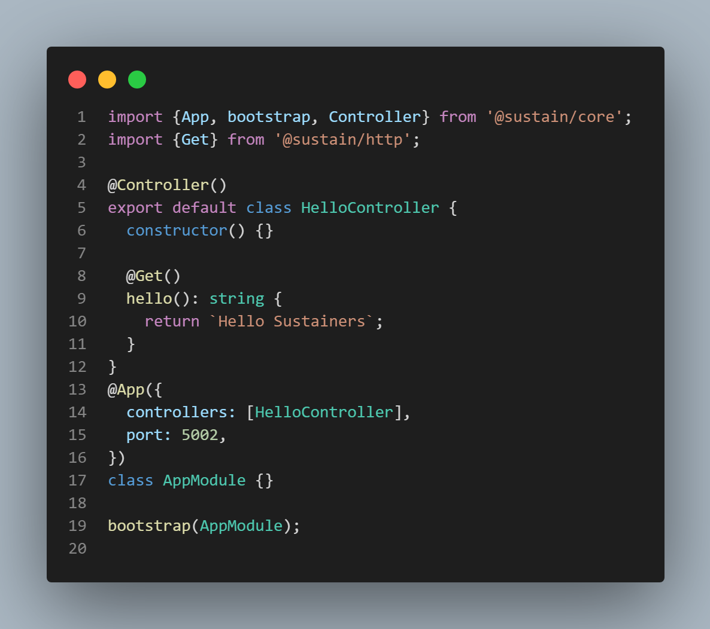

#  Sustain &nbsp;&nbsp;   [](https://sonarcloud.io/dashboard?id=labidiaymen_sustain)  


## Description

Sustain is a Framework that barely uses despedencies and it is designed especially to make stable and sustainable apps. It is built with [TypeScript](https://www.typescriptlang.org/), uses OOP (Object Oriented Programming) and built-in [Dependency Injections](https://en.wikipedia.org/wiki/Dependency_injection). 

This frameowrk touches in depth the web fundemantals and implements them from scratch with zero dependencies which makes it more reliable and durable.

## Philosophy

Building an application that depends on [packages](https://www.npmjs.com/) that they may be also depending on other packages is something that requires a periodic maintenance by installing the latest updates. 
This dependency will expose your application to eventual instability and vulnerability. 

Decoupling the application from the dependant packages by using the Sustain framework will make the maintenance focused on only one package.


## Installation

```cmd

npm install -g @sustain/cli
 
sustain new sustain-project

cd sustain-project

npm install

sustain start

```

Or you can start with a one file application
#  

```typescript
import { App, bootstrap, Controller } from '@sustain/core';
import { Get } from '@sustain/http';

@Controller()
export default class HelloController {
    constructor() { }

    @Get()
    hello(): string {
        return `Hello Sustainers`;
    }
}
@App({
    controllers: [
        HelloController,
    ],
    port: process.env.PORT || 5002
})
class AppModule { }

module.exports = bootstrap(AppModule);

```

## Documentation
 [https://sustainland.github.io/docs](https://sustainland.github.io/docs)

## Author

* Website - [aymen.co](https://aymen.co)
* Twitter - [@labidiaymen](https://twitter.com/labidiaymen)

## GA Release 🚀
More about the first GA Release : https://github.com/sustainland/sustain/issues/1

## License

[MIT licensed](LICENSE).
